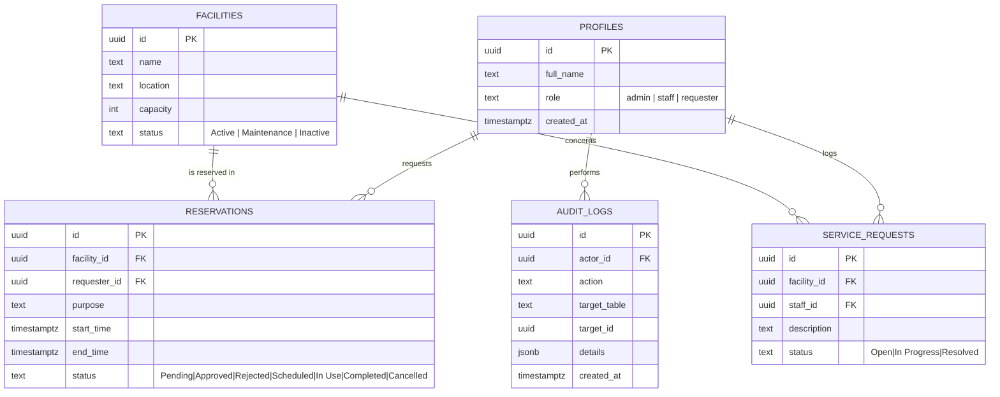
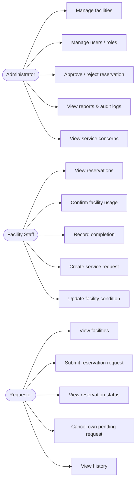
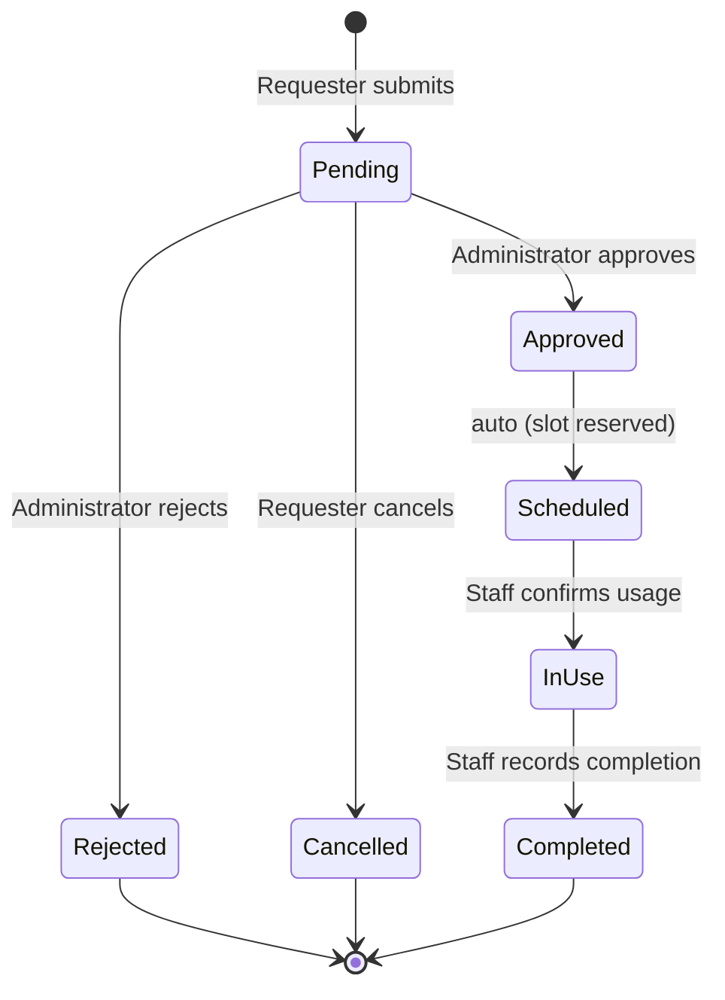

# Laboratory 4 (Section B) — Role-Based Facility Reservation and Approval System

## 1. Entity-Relationship Diagram

## 2. Use Case Diagram

## 3. Role-Permission Matrix

| Function                              | Administrator | Facility Staff | Requester |
|----------------------------------------|:---:|:---:|:---:|
| View facilities                        | ✔ | ✔ | ✔ |
| Add / edit / delete facilities         | ✔ | — | — |
| Update facility condition (status)     | ✔ | ✔ | — |
| Submit reservation request             | — | — | ✔ |
| View own reservations / history        | — | — | ✔ |
| Cancel/edit own Pending request        | — | — | ✔ |
| View all reservations                  | ✔ | ✔ | — |
| Approve / reject reservation           | ✔ | — | — |
| Mark reservation In Use                | — | ✔ | — |
| Mark reservation Completed             | — | ✔ | — |
| Create service request                 | — | ✔ | — |
| View service concerns                  | ✔ | ✔ | — |
| Manage users / assign roles            | ✔ | — | — |
| View audit logs                        | ✔ | — | — |

Enforced two ways: the dashboard UI only renders controls for the signed-in role, and Postgres Row-Level Security policies plus triggers enforce the same limits server-side (see `sql/schema.sql`), so a user cannot bypass the matrix by calling the API directly.

## 4. Reservation Workflow

In the implementation, `Approved` auto-promotes to `Scheduled` in the same transaction (a database trigger), because BR-B4-06 treats an approved reservation as immediately reserving the time slot.

## 5. Business Rules — Implementation Reference

| ID | Rule | Enforced by |
|----|------|-------------|
| BR-B4-01 | Only active facilities may be reserved | `trg_check_facility_active` trigger (insert) |
| BR-B4-02 | Reservation start must precede end time | `chk_time_order` CHECK constraint + client-side validation |
| BR-B4-03 | Overlapping approved schedules are prohibited | `trg_check_reservation_conflict` trigger (range overlap check) |
| BR-B4-04 | Only Administrator may approve reservations | RLS policy `reservations_update_admin` |
| BR-B4-05 | Rejected reservations cannot become Scheduled | `trg_check_reservation_transition` trigger |
| BR-B4-06 | Approved reservations reserve the time slot | Auto-promotion to `Scheduled` inside conflict trigger |
| BR-B4-07 | Completed reservations cannot be edited | `trg_check_reservation_transition` trigger |
| BR-B4-08 | Facilities under Maintenance cannot be reserved | `trg_check_facility_active` trigger |
| BR-B4-09 | Requesters may modify only their own Pending requests | RLS policy `reservations_update_own_pending` |
| BR-B4-10 | Approval and status changes must be logged | `trg_log_reservation` / `trg_log_facility` triggers → `audit_logs` |

## 6. Audit Trail

`audit_logs` records: reservation submission, every reservation status change (approval, rejection, cancellation, scheduling, completion), facility status updates, and facility deletions. Each row stores the actor, the action, the affected table/row, a JSON detail payload, and a timestamp. Only Administrators can read this table (`audit_logs_admin_select` policy).

## 7. Functional Test Plan

| Test ID | Scenario | Steps | Expected Result | Status |
|---|---|---|---|---|
| TC-B4-01 | Requester submits reservation | Sign in as requester → Reserve tab → submit a valid request | Saved as **Pending** | ☐ |
| TC-B4-02 | Submit overlapping schedule | Submit a second request for the same facility/time as an Approved one | Conflict detected and blocked | ☐ |
| TC-B4-03 | Administrator approves request | Sign in as admin → Reservations tab → Approve a Pending row | Status becomes **Approved/Scheduled** | ☐ |
| TC-B4-04 | Administrator rejects request | Reject a Pending row | Status becomes **Rejected** | ☐ |
| TC-B4-05 | Staff marks facility In Use | Sign in as staff → mark a Scheduled reservation In Use | Status updated to **In Use** | ☐ |
| TC-B4-06 | Staff completes reservation | Mark an In Use reservation Completed | Status becomes **Completed** | ☐ |
| TC-B4-07 | Requester edits another user's request | Attempt to update a reservation you don't own via a second account | Blocked by RLS | ☐ |
| TC-B4-08 | Reserve facility under maintenance | Set a facility to Maintenance, then try to reserve it | Blocked by trigger | ☐ |
| TC-B4-09 | Check audit log | Sign in as admin → Audit Log tab after any approval/status change | Approval/status log entry visible | ☐ |
| TC-B4-10 | Open protected page without login | Visit `dashboard.html` while signed out | Redirected to sign-in page | ☐ |

Fill in the **Status** column with Pass/Fail and a screenshot once you run each test against your deployed Supabase project — that, plus the audit-log screenshot, satisfies submission items 7–8.

## 8. Submission Checklist

1. GitHub repository URL
2. Live GitHub Pages URL
3. This ERD and Use Case Diagram (render the Mermaid blocks above, e.g. GitHub renders `.md` Mermaid natively)
4. Role-permission matrix (Section 3)
5. Reservation workflow (Section 4)
6. Business rules (Section 5)
7. Audit-log screenshot (from the Audit Log tab, signed in as Administrator)
8. Functional test results (Section 7, filled in)
